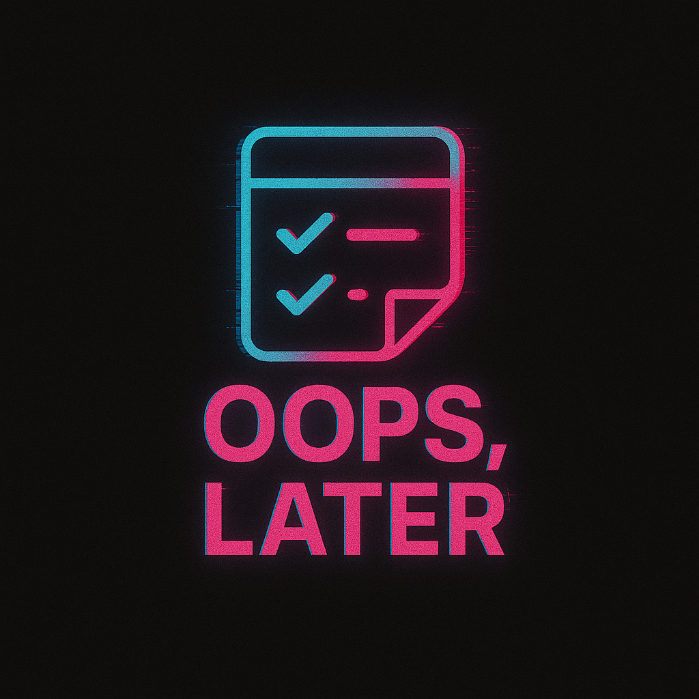
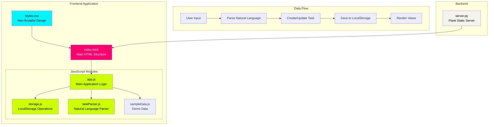
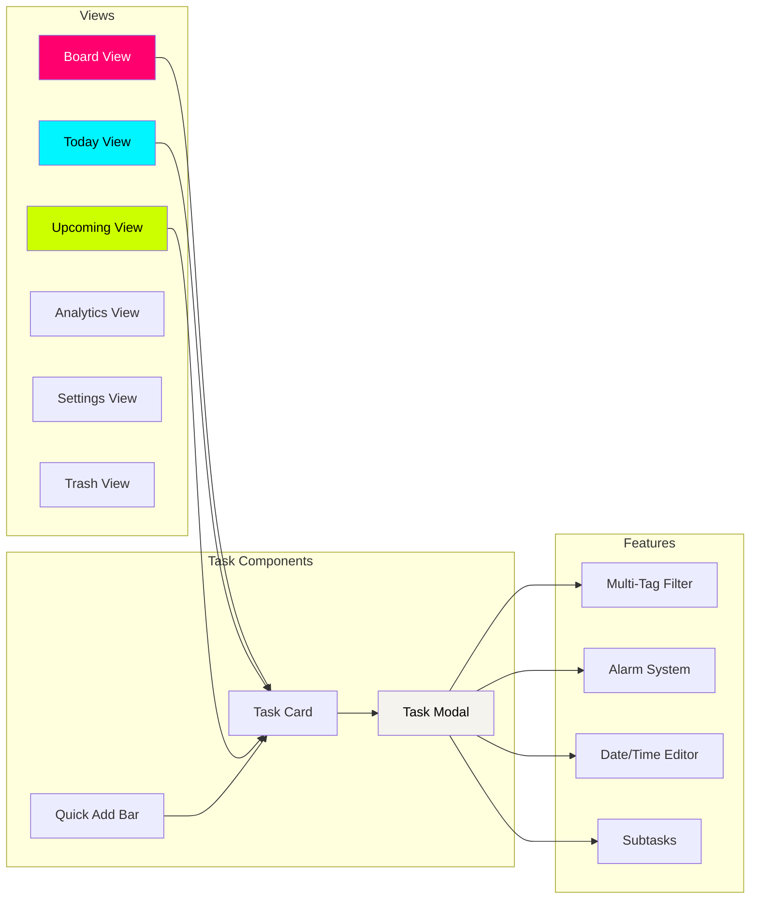
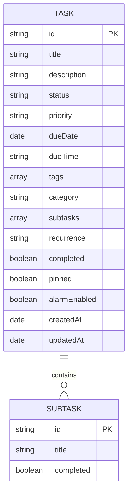

<p align="center">
  
</p>

<h1 align="center">Oops, Later! 😅📝</h1>

<p align="center">
  <b>Procrastinate with style.</b><br/>
  A playful, personality-driven todo app for procrastinators who still want to get things done — built with <b>HTML, CSS & JavaScript</b> (plus an optional tiny <b>Python</b> server for local development).
</p>

<p align="center">
  <a href="#table-of-contents">📚 Table of Contents</a> •
  <a href="#features">✨ Features</a> •
  <a href="#getting-started">🚀 Getting Started</a> •
  <a href="#project-structure">🧱 Structure</a> •
  <a href="#contributing">🤝 Contributing</a>
</p>

<p align="center">
  <a href="#quick-start">View Demo</a> •
  <a href="../../issues/new?labels=bug">Report Bug</a> •
  <a href="../../issues/new?labels=enhancement">Request Feature</a> •
  <a href="#faq">FAQ</a> •
  <a href="../../discussions">Ask Question</a>
</p>

<p align="center">
  
  
  
  
</p>

---

<a id="table-of-contents"></a>
## Table of Contents 📚

- [Important Notices](#important-notices)
- [Features ✨](#features)
  - [Task Management ✅](#task-management)
  - [Tag System 🏷️](#tag-system)
  - [Scheduling & Reminders ⏰](#scheduling-reminders)
  - [Organization Features 🧩](#organization-features)
  - [Views 🗂️](#views)
  - [Design Features 🎨](#design-features)
  - [Data Management 💾](#data-management)
  - [Energy Mode 🔋](#energy-mode)
  - [Task Estimates ⏳](#task-estimates)
  - [Keyboard Shortcuts ⌨️](#keyboard-shortcuts)
- [Architecture 🏗️](#architecture)
- [Component Diagram 🧭](#component-diagram)
- [Data Model 🗃️](#data-model)
- [Tech Stack 🧰](#tech-stack)
- [Getting Started 🚀](#getting-started)
  - [Prerequisites 🧾](#prerequisites)
  - [Installation 🛠️](#installation)
  - [Environment Variables 🔐](#environment-variables)
  - [Quick Start ⚡](#quick-start)
- [Project Structure 🧱](#project-structure)
- [Design System 🎛️](#design-system)
  - [Colors 🎨](#colors)
  - [Typography 🔤](#typography)
  - [Shadows 🌫️](#shadows)
- [Browser Support 🌐](#browser-support)
- [FAQ ❓](#faq)
- [Contributing 🤝](#contributing)
- [License 📄](#license)
- [Acknowledgments 🙌](#acknowledgments)

---

<a id="important-notices"></a>
## Important Notices ⚠️

> [!IMPORTANT]
> **No accounts / cloud sync.** Your tasks are stored in your browser (Local Storage). Clearing site data or switching browsers/devices can remove them.
>
> **Backup tip:** use the **Export (JSON/CSV)** feature before big changes.

> [!NOTE]
> This is intentionally an MVP/student project — lightweight by design (fast, fun UX > heavy integrations).

🔝 [ToC](#table-of-contents)

<a id="features"></a>
## Features ✨

🔝 [ToC](#table-of-contents)


<a id="task-management"></a>
### Task Management ✅

🔝 [ToC](#table-of-contents)

- **Natural Language Task Creation** - Type tasks naturally in the quick-add bar
  - Examples: "Call mom tomorrow 3pm high priority #family"
  - Examples: "Buy groceries #shopping"
  - Examples: "Meeting tomorrow 3pm high priority"
- **Kanban Board** - Visual task management with Todo, Doing, and Done columns
- **Drag & Drop** - Move tasks between columns by dragging
- **Task Details Modal** - Expandable cards with full editing capabilities
- **Subtasks** - Break down tasks into smaller actionable items
- **Bulk Actions** - Select multiple tasks for batch operations

<a id="tag-system"></a>
### Tag System 🏷️

🔝 [ToC](#table-of-contents)

- **Multi-Tag Support** - Add multiple tags to any task
- **Tag Filtering** - Filter tasks by one or more tags simultaneously
- **Quick Tag Selection** - Click existing tags to add them to tasks
- **Create New Tags** - Add custom tags on the fly

<a id="scheduling-reminders"></a>
### Scheduling & Reminders ⏰

🔝 [ToC](#table-of-contents)

- **Due Date & Time** - Set specific deadlines for tasks
- **Editable Schedule** - Modify date and time directly in the task modal
- **Push Notifications with Sound** - Browser notifications with audio alerts that work even when the tab is not focused
  - 5-minute warning notification before task is due
  - Immediate notification when task is due
  - Overdue notification for missed deadlines
  - Urgent sound alerts for time-critical notifications
- **Per-Task Alarm Toggle** - Enable/disable alarms for individual tasks
- **Snooze Options** - Reschedule tasks by 1 day or 1 week
- **Overdue Alerts** - Get notified when tasks are past due

<a id="organization-features"></a>
### Organization Features 🧩

🔝 [ToC](#table-of-contents)

- **Pin Tasks** - Keep important tasks at the top
- **Priority Levels** - High, Medium, Low with color-coded indicators
- **Recurrence** - Set repeating tasks
- **Task Duplication** - Quickly create copies of tasks

<a id="views"></a>
### Views 🗂️

🔝 [ToC](#table-of-contents)

- **Board View** - Kanban-style with three columns
- **Today View** - Focus on today's tasks and overdue items
- **Upcoming View** - See scheduled tasks for the next 7 days and beyond
- **Analytics View** - Visual statistics of your productivity
- **Trash View** - Recover or permanently delete tasks

<a id="design-features"></a>
### Design Features 🎨

🔝 [ToC](#table-of-contents)

- **Neo-Brutalist UI** - Bold borders, hard shadows, and neon accent colors
- **Dark Mode** - Toggle between light and dark themes
- **Responsive Layout** - Works on desktop and mobile devices
- **Smooth Animations** - Bounce-in effects and transitions
- **Minimal Scrollbars** - Clean, unobtrusive scrollbars
- **Custom Typography** - Syne, Space Grotesk, and JetBrains Mono fonts

<a id="data-management"></a>
### Data Management 💾

🔝 [ToC](#table-of-contents)

- **Local Storage** - All data stored in browser (no account needed)
- **Export Options** - Download tasks as JSON or CSV
- **Sample Data** - Load example tasks to get started
- **Offline Support** - Works completely offline
- **Trash & Recovery** - Recover deleted tasks

<a id="energy-mode"></a>
### Energy Mode 🔋

🔝 [ToC](#table-of-contents)

- **Time Available Options** - 15 min, 30 min, 60 min, 60+, and "I'm super energised"
- **Energy Level Filtering** - Low, Medium, High effort levels
- **Dynamic Taglines** - Context-aware messages based on your energy level and available time
  - Low energy: Easy, low-effort task suggestions
  - Steady energy: Balanced mix of tasks
  - High energy: High-impact, chunky tasks
- **Smart Task Matching** - Tasks are filtered based on:
  - Estimate time matching your available time
  - Effort level matching your energy level
  - Priority-based sorting with due dates
- **Shuffle Feature** - Randomize suggested tasks for variety
- **Focus Mode Integration** - Start tasks directly from energy mode

<a id="task-estimates"></a>
### Task Estimates ⏳

🔝 [ToC](#table-of-contents)

- **Preset Options** - 5, 15, 30, 60 minutes
- **Custom Duration** - Set any custom time estimate
- **Undefined Option** - Leave estimate undefined for flexible tasks

<a id="keyboard-shortcuts"></a>
### Keyboard Shortcuts ⌨️

🔝 [ToC](#table-of-contents)

| Shortcut | Action |
|----------|--------|
| `Enter` | Focus quick-add bar (type task, press Enter again to add) |
| `D` | Toggle Dark Mode |
| `N` | Open new task form |
| `/` | Open global search |
| `+` | Add task (click button) |
| `Esc` | Close Modal / Clear Filters |

<a id="architecture"></a>
## Architecture 🏗️

🔝 [ToC](#table-of-contents)




<a id="component-diagram"></a>
## Component Diagram 🧭

🔝 [ToC](#table-of-contents)




<a id="data-model"></a>
## Data Model 🗃️

🔝 [ToC](#table-of-contents)




<a id="tech-stack"></a>
## Tech Stack 🧰

🔝 [ToC](#table-of-contents)


- **HTML5** - Structure
- **CSS3** - Styling (custom brutalist design system)
- **JavaScript (ES6)** - Application logic (vanilla, no frameworks)
- **Python Flask** - Static file server
- **Waitress** - Production WSGI server (Windows compatible)

<a id="getting-started"></a>
## Getting Started 🚀

🔝 [ToC](#table-of-contents)


<a id="prerequisites"></a>
### Prerequisites 🧾

🔝 [ToC](#table-of-contents)

- Python 3.x installed
- Modern web browser (Chrome, Firefox, Safari, Edge)

<a id="installation"></a>
### Installation 🛠️

🔝 [ToC](#table-of-contents)


1. **Clone the repository:**
   ```bash
   git clone <repository-url>
   cd oops-later
   ```

2. **Install dependencies:**
   ```bash
   pip install flask waitress
   ```

3. **Start the server:**
   
   **Windows (Production ready):**
   ```bash
   python server.py
   ```
   
   **Linux/Mac (Development):**
   ```bash
   python server.py
   ```
   
   The server automatically detects Windows and uses Waitress for production-ready serving.

4. **Open in browser:**
   Navigate to `http://localhost:5000`

<a id="environment-variables"></a>
### Environment Variables 🔐

🔝 [ToC](#table-of-contents)

| Variable | Description | Default |
|----------|-------------|---------|
| `PORT` | Server port | 5000 |
| `USE_WAITRESS` | Force Waitress server (any value) | - |

<a id="quick-start"></a>
### Quick Start ⚡

🔝 [ToC](#table-of-contents)

1. On first visit, choose to load sample tasks or start fresh
2. Type a task in the quick-add bar using natural language
3. Click on any task card to view/edit details
4. Use the sidebar to switch between different views
5. Toggle dark mode with the button at the bottom of the sidebar

<a id="project-structure"></a>
## Project Structure 🧱

🔝 [ToC](#table-of-contents)


```
oops-later/
├── index.html              # Main HTML page
├── server.py               # Python Flask server
├── README.md               # This file
├── css/
│   └── styles.css          # All styles (brutalist design system)
└── js/
    ├── app.js              # Main application logic
    ├── storage.js          # LocalStorage operations
    ├── taskParser.js       # Natural language parser
    └── sampleData.js       # Sample tasks for demo
```

<a id="design-system"></a>
## Design System 🎛️

🔝 [ToC](#table-of-contents)


<a id="colors"></a>
### Colors 🎨

🔝 [ToC](#table-of-contents)

| Name | Hex | Usage |
|------|-----|-------|
| Neon Pink | `#ff006e` | High priority, active states |
| Neon Cyan | `#00f5ff` | Medium priority, progress bars |
| Neon Lime | `#ccff00` | Low priority, tags, buttons |
| Cream | `#f5f3ed` | Light background |
| Charcoal | `#1a1a1a` | Dark background |

<a id="typography"></a>
### Typography 🔤

🔝 [ToC](#table-of-contents)

| Type | Font | Usage |
|------|------|-------|
| Display | Syne | Headings, titles |
| Body | Space Grotesk | Content, labels |
| Mono | JetBrains Mono | Badges, code, dates |

<a id="shadows"></a>
### Shadows 🌫️

🔝 [ToC](#table-of-contents)

| Name | Value |
|------|-------|
| brutal-sm | `4px 4px 0px 0px #000` |
| brutal | `8px 8px 0px 0px #000` |
| brutal-lg | `12px 12px 0px 0px #000` |

<a id="browser-support"></a>
## Browser Support 🌐

🔝 [ToC](#table-of-contents)


- Chrome (latest)
- Firefox (latest)
- Safari (latest)
- Edge (latest)

<a id="faq"></a>
## FAQ ❓

🔝 [ToC](#table-of-contents)

**Q: Where is my data stored?**
- In your browser’s **Local Storage** (no account required).

**Q: Will it work offline?**
- Yes — once loaded, you can keep using it without internet (unless you’re using a hosted API endpoint).

**Q: Why is there a Python server in a “vanilla” app?**
- It’s optional: a tiny local server can make local development smoother (no CORS headaches). You can still open the app directly if your setup allows it.

🔝 [ToC](#table-of-contents)

<a id="contributing"></a>
## Contributing 🤝

🔝 [ToC](#table-of-contents)


1. Fork the repository
2. Create a feature branch (`git checkout -b feature/amazing-feature`)
3. Commit your changes (`git commit -m 'Add amazing feature'`)
4. Push to the branch (`git push origin feature/amazing-feature`)
5. Open a Pull Request

<a id="license"></a>
## License 📄

🔝 [ToC](#table-of-contents)


This project is open source and available under the MIT License.

<a id="acknowledgments"></a>
## Acknowledgments 🙌

🔝 [ToC](#table-of-contents)


- Design inspired by neo-brutalist web design trends
- Fonts from Google Fonts
- Built with vanilla technologies for maximum performance
