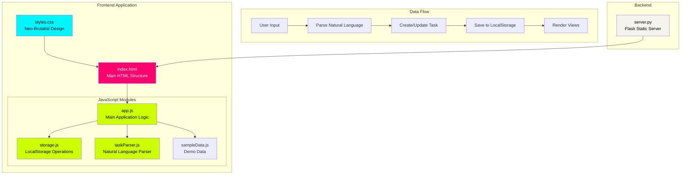
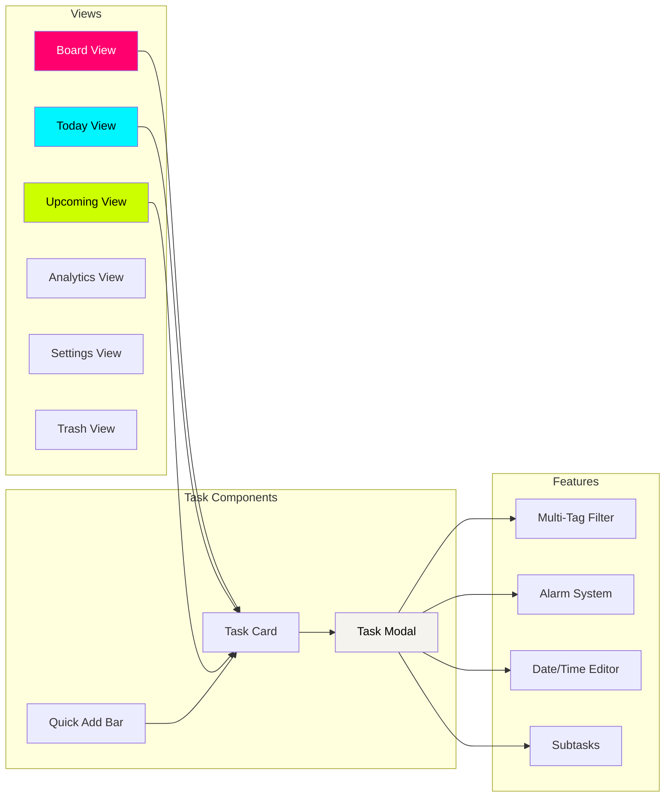
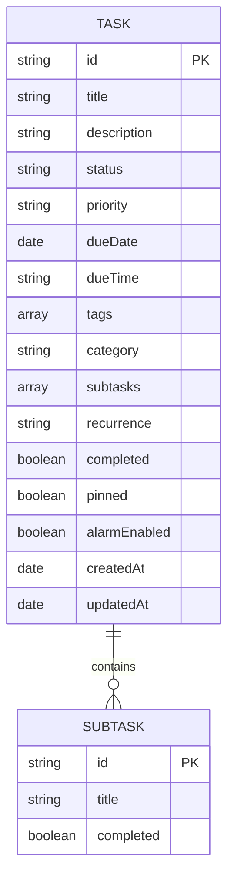

# Oops, Later! 😅📝

A playful, personality-driven todo app for procrastinators who need a gentle (but firm) nudge. Built with vanilla **HTML + CSS + JavaScript** (with a tiny **Python Flask** static server) and a bold neo‑brutalist vibe.

**Quick links:** [Features](#features) • [Getting Started](#getting-started) • [Project Structure](#project-structure) • [Contributing](#contributing)

---

<a id="table-of-contents"></a>
## Table of Contents 📚

- [Features](#features)
  - [Task Management](#task-management)
  - [Tag System](#tag-system)
  - [Scheduling & Reminders](#scheduling--reminders)
  - [Organization Features](#organization-features)
  - [Views](#views)
  - [Design Features](#design-features)
  - [Data Management](#data-management)
  - [Energy Mode](#energy-mode)
  - [Task Estimates](#task-estimates)
  - [Keyboard Shortcuts](#keyboard-shortcuts)
- [Architecture](#architecture)
- [Component Diagram](#component-diagram)
- [Data Model](#data-model)
- [Tech Stack](#tech-stack)
- [Getting Started](#getting-started)
  - [Prerequisites](#prerequisites)
  - [Installation](#installation)
  - [Environment Variables](#environment-variables)
  - [Quick Start](#quick-start)
- [Project Structure](#project-structure)
- [Design System](#design-system)
  - [Colors](#colors)
  - [Typography](#typography)
  - [Shadows](#shadows)
- [Browser Support](#browser-support)
- [Contributing](#contributing)
- [License](#license)
- [Acknowledgments](#acknowledgments)

---

<a id="features"></a>
## Features ✨

<a id="task-management"></a>
### Task Management ✅
- **Natural Language Task Creation** — Type tasks naturally in the quick-add bar  
  - Examples: `"Call mom tomorrow 3pm high priority #family"`  
  - Examples: `"Buy groceries #shopping"`  
  - Examples: `"Meeting tomorrow 3pm high priority"`
- **Kanban Board** — Visual task management with Todo, Doing, and Done columns
- **Drag & Drop** — Move tasks between columns by dragging
- **Task Details Modal** — Expandable cards with full editing capabilities
- **Subtasks** — Break down tasks into smaller actionable items
- **Bulk Actions** — Select multiple tasks for batch operations

🔝 [ToC](#table-of-contents)

<a id="tag-system"></a>
### Tag System 🏷️
- **Multi-Tag Support** — Add multiple tags to any task
- **Tag Filtering** — Filter tasks by one or more tags simultaneously
- **Quick Tag Selection** — Click existing tags to add them to tasks
- **Create New Tags** — Add custom tags on the fly

🔝 [ToC](#table-of-contents)

<a id="scheduling--reminders"></a>
### Scheduling & Reminders ⏰🔔
- **Due Date & Time** — Set specific deadlines for tasks
- **Editable Schedule** — Modify date and time directly in the task modal
- **Push Notifications with Sound** — Browser notifications with audio alerts that work even when the tab is not focused  
  - 5-minute warning notification before task is due  
  - Immediate notification when task is due  
  - Overdue notification for missed deadlines  
  - Urgent sound alerts for time-critical notifications
- **Per-Task Alarm Toggle** — Enable/disable alarms for individual tasks
- **Snooze Options** — Reschedule tasks by 1 day or 1 week
- **Overdue Alerts** — Get notified when tasks are past due

🔝 [ToC](#table-of-contents)

<a id="organization-features"></a>
### Organization Features 🗂️
- **Pin Tasks** — Keep important tasks at the top
- **Priority Levels** — High, Medium, Low with color-coded indicators
- **Recurrence** — Set repeating tasks
- **Task Duplication** — Quickly create copies of tasks

🔝 [ToC](#table-of-contents)

<a id="views"></a>
### Views 🧭
- **Board View** — Kanban-style with three columns
- **Today View** — Focus on today's tasks and overdue items
- **Upcoming View** — See scheduled tasks for the next 7 days and beyond
- **Analytics View** — Visual statistics of your productivity
- **Trash View** — Recover or permanently delete tasks

🔝 [ToC](#table-of-contents)

<a id="design-features"></a>
### Design Features 🎨🧱
- **Neo-Brutalist UI** — Bold borders, hard shadows, and neon accent colors
- **Dark Mode** — Toggle between light and dark themes
- **Responsive Layout** — Works on desktop and mobile devices
- **Smooth Animations** — Bounce-in effects and transitions
- **Minimal Scrollbars** — Clean, unobtrusive scrollbars
- **Custom Typography** — Syne, Space Grotesk, and JetBrains Mono fonts

🔝 [ToC](#table-of-contents)

<a id="data-management"></a>
### Data Management 💾
- **Local Storage** — All data stored in browser (no account needed)
- **Export Options** — Download tasks as JSON or CSV
- **Sample Data** — Load example tasks to get started
- **Offline Support** — Works completely offline
- **Trash & Recovery** — Recover deleted tasks

🔝 [ToC](#table-of-contents)

<a id="energy-mode"></a>
### Energy Mode ⚡😴
- **Time Available Options** — 15 min, 30 min, 60 min, 60+, and "I'm super energised"
- **Energy Level Filtering** — Low, Medium, High effort levels
- **Dynamic Taglines** — Context-aware messages based on your energy level and available time  
  - Low energy: Easy, low-effort task suggestions  
  - Steady energy: Balanced mix of tasks  
  - High energy: High-impact, chunky tasks
- **Smart Task Matching** — Tasks are filtered based on:  
  - Estimate time matching your available time  
  - Effort level matching your energy level  
  - Priority-based sorting with due dates
- **Shuffle Feature** — Randomize suggested tasks for variety
- **Focus Mode Integration** — Start tasks directly from energy mode

🔝 [ToC](#table-of-contents)

<a id="task-estimates"></a>
### Task Estimates ⏱️
- **Preset Options** — 5, 15, 30, 60 minutes
- **Custom Duration** — Set any custom time estimate
- **Undefined Option** — Leave estimate undefined for flexible tasks

🔝 [ToC](#table-of-contents)

<a id="keyboard-shortcuts"></a>
### Keyboard Shortcuts ⌨️

| Shortcut | Action |
|----------|--------|
| `Enter` | Focus quick-add bar (type task, press Enter again to add) |
| `D` | Toggle Dark Mode |
| `N` | Open new task form |
| `/` | Open global search |
| `+` | Add task (click button) |
| `Esc` | Close Modal / Clear Filters |

🔝 [ToC](#table-of-contents)

---

<a id="architecture"></a>
## Architecture 🏗️



🔝 [ToC](#table-of-contents)

---

<a id="component-diagram"></a>
## Component Diagram 🧩



🔝 [ToC](#table-of-contents)

---

<a id="data-model"></a>
## Data Model 🧬



🔝 [ToC](#table-of-contents)

---

<a id="tech-stack"></a>
## Tech Stack 🧱

- **HTML5** — Structure
- **CSS3** — Styling (custom brutalist design system)
- **JavaScript (ES6)** — Application logic (vanilla, no frameworks)
- **Python Flask** — Static file server
- **Waitress** — Production WSGI server (Windows compatible)

🔝 [ToC](#table-of-contents)

---

<a id="getting-started"></a>
## Getting Started 🚀

<a id="prerequisites"></a>
### Prerequisites 🧰
- Python 3.x installed
- Modern web browser (Chrome, Firefox, Safari, Edge)

🔝 [ToC](#table-of-contents)

<a id="installation"></a>
### Installation 🛠️

1. **Clone the repository:**
   ```bash
   git clone <repository-url>
   cd oops-later
   ```

2. **Install dependencies:**
   ```bash
   pip install flask waitress
   ```

3. **Start the server:**

   **Windows (Production ready):**
   ```bash
   python server.py
   ```

   **Linux/Mac (Development):**
   ```bash
   python server.py
   ```

   The server automatically detects Windows and uses Waitress for production-ready serving.

4. **Open in browser:**
   Navigate to `http://localhost:5000`

🔝 [ToC](#table-of-contents)

<a id="environment-variables"></a>
### Environment Variables 🔐
| Variable | Description | Default |
|----------|-------------|---------|
| `PORT` | Server port | 5000 |
| `USE_WAITRESS` | Force Waitress server (any value) | - |

🔝 [ToC](#table-of-contents)

<a id="quick-start"></a>
### Quick Start ⚡
1. On first visit, choose to load sample tasks or start fresh
2. Type a task in the quick-add bar using natural language
3. Click on any task card to view/edit details
4. Use the sidebar to switch between different views
5. Toggle dark mode with the button at the bottom of the sidebar

🔝 [ToC](#table-of-contents)

---

<a id="project-structure"></a>
## Project Structure 🗂️

```
oops-later/
├── index.html              # Main HTML page
├── server.py               # Python Flask server
├── README.md               # This file
├── css/
│   └── styles.css          # All styles (brutalist design system)
└── js/
    ├── app.js              # Main application logic
    ├── storage.js          # LocalStorage operations
    ├── taskParser.js       # Natural language parser
    └── sampleData.js       # Sample tasks for demo
```

🔝 [ToC](#table-of-contents)

---

<a id="design-system"></a>
## Design System 🎛️

<a id="colors"></a>
### Colors 🌈
| Name | Hex | Usage |
|------|-----|-------|
| Neon Pink | `#ff006e` | High priority, active states |
| Neon Cyan | `#00f5ff` | Medium priority, progress bars |
| Neon Lime | `#ccff00` | Low priority, tags, buttons |
| Cream | `#f5f3ed` | Light background |
| Charcoal | `#1a1a1a` | Dark background |

🔝 [ToC](#table-of-contents)

<a id="typography"></a>
### Typography 🔤
| Type | Font | Usage |
|------|------|-------|
| Display | Syne | Headings, titles |
| Body | Space Grotesk | Content, labels |
| Mono | JetBrains Mono | Badges, code, dates |

🔝 [ToC](#table-of-contents)

<a id="shadows"></a>
### Shadows 🧱🌑
| Name | Value |
|------|-------|
| brutal-sm | `4px 4px 0px 0px #000` |
| brutal | `8px 8px 0px 0px #000` |
| brutal-lg | `12px 12px 0px 0px #000` |

🔝 [ToC](#table-of-contents)

---

<a id="browser-support"></a>
## Browser Support 🌐

- Chrome (latest)
- Firefox (latest)
- Safari (latest)
- Edge (latest)

🔝 [ToC](#table-of-contents)

---

<a id="contributing"></a>
## Contributing 🤝

1. Fork the repository
2. Create a feature branch (`git checkout -b feature/amazing-feature`)
3. Commit your changes (`git commit -m 'Add amazing feature'`)
4. Push to the branch (`git push origin feature/amazing-feature`)
5. Open a Pull Request

🔝 [ToC](#table-of-contents)

---

<a id="license"></a>
## License 📄

This project is open source and available under the MIT License.

🔝 [ToC](#table-of-contents)

---

<a id="acknowledgments"></a>
## Acknowledgments 🙌

- Design inspired by neo-brutalist web design trends
- Fonts from Google Fonts
- Built with vanilla technologies for maximum performance

🔝 [ToC](#table-of-contents)
